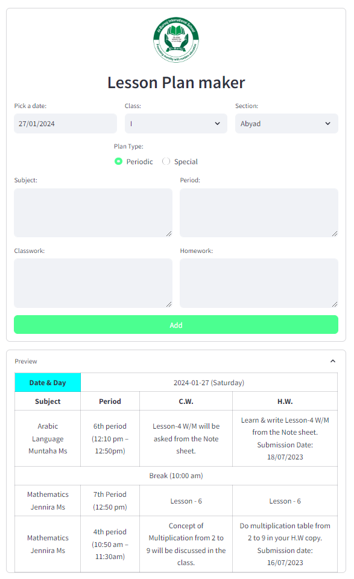
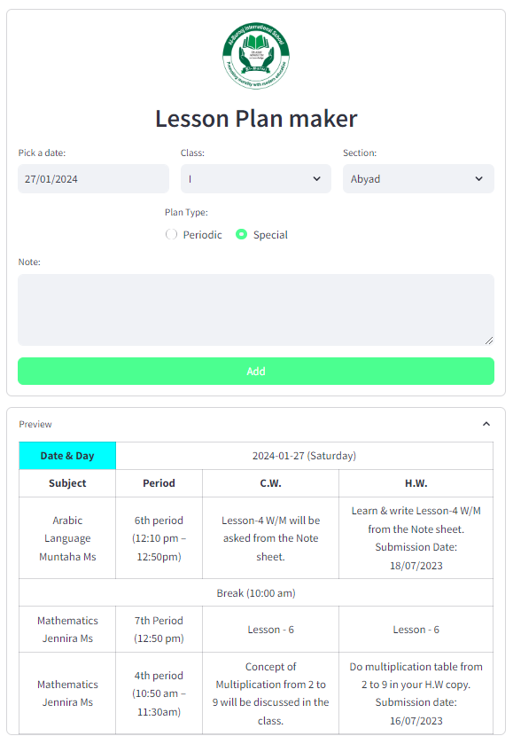
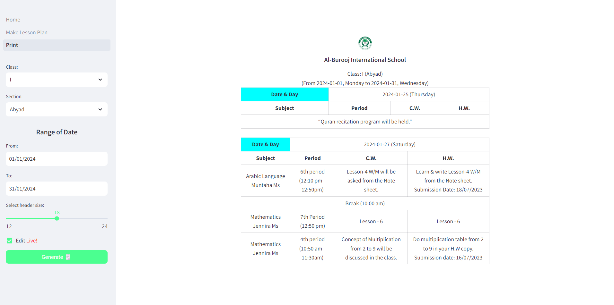

# School Lesson Plan Maker

**Preface**

Having gained proficiency in [ORACLE APEX](https://apex.oracle.com/en/platform/apex-oracle-cloud/) for developing systems capable of producing automated reports, we decided to push our boundaries by exploring the possibility of achieving the same functionality exclusively through Python.

Given that Streamlit is a Python framework designed for creating Data Apps and supports HTML injection into the code body, we found it to be a suitable choice for our challenge. Surprisingly, the transition was smoother than anticipated.

# About the repository

## `📁 app/`
Contains all the python scripts

and
### Our landing page   `Home.py`

### `📁 pages/`
___

Contains all the different page and routes.
####  `Make_Lesson_Plan.py`
___

Page that allows you to make lesson plans.





####  `Print.py`
___

Allows you to filter the data according to date, class and section and print them in pdfs.



### `📁 utils/`

___

Contains   `essentials.py` which is responsible for -

* Generating Tables - `add_rows(), show_table()`
* Formatting Dates - `convert_to_date_time(), findDay(), date_translate()`
* Reading and Writing into CSV files - `write_to_csv(), read_csv()`

##   `main.py`

Code that runs the entire app

## 🗒️ requirements.txt
Contains all the installation dependencies.

##  start.sh
Bash script that starts your virtual environment and app altogether. Run it using -
```bash
source start.sh
```

<h2 align = "center">  Setting up the Development Environment </h2>

 Create Virtual Environment

```bash
virtualenv env
```
 Activate `env`

```bash
source env/Scripts/activate
```

 Install requirements 

```bash
pip install -r requirements.txt
```

 Run the project

```bash
python ./main.py
```
or 

```bash
python app/Home.py
```

<h2 align="center"> <a href="https://www.docker.com/" target="_blank" rel="noreferrer">  </a> Docker </h2>

### <a href="https://www.docker.com/" target="_blank" rel="noreferrer">  </a> `build`

```bash
docker build -t school-lp-maker .
```

<h3 align="center">Technologies and Links</h3>

___

<p align="center"> 
<a href="https://streamlit.io/" title="FastAPI" target="_blank"></a> 
 <a href="https://www.docker.com/" target="_blank" rel="noreferrer">  </a>
</p>
